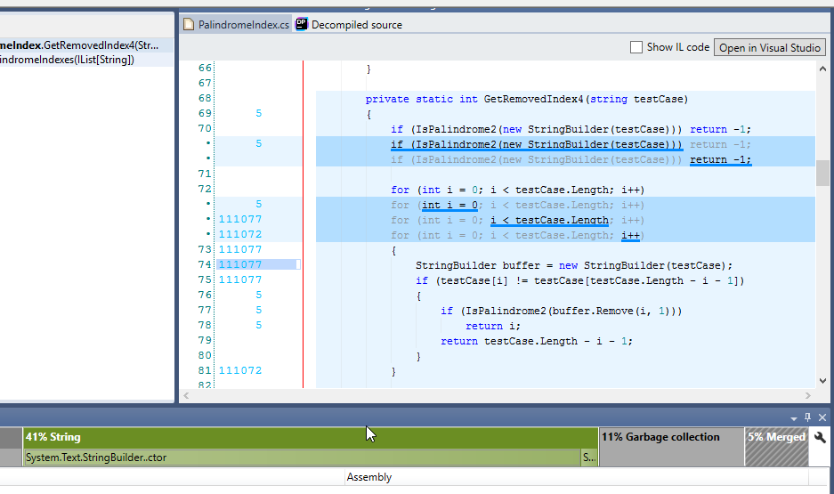

\[caption id="attachment_287" align="alignright" width="300"\] Palindrome Index\[/caption\]

I've been having a problem with an easy [HackerRank](https://www.hackerrank.com) problem, [Palindrome Index](https://www.hackerrank.com/notifications/page/1).

I knew that I was on the right track since answers for test cases were correct. But then I ran into a problem where most of test cases time out after submitting the code.

I'd like to talk about how I solved the performance issue.

[HackerRank](https://www.hackerrank.com/dashboard) allows only up to 3 seconds of execution time per test case for C# programs. For some of the test cases, my program ran fine but for the majority of them, it was timing out.

I came up with 4 different implementations for the problem but I wasn't still able to solve all issues (There were still 4 out of 15 cases that were timing out for the last implementation. You can see the history of my implementation changes on [GitHub](https://github.com/dance2die/Problems.HackerRank/commits/master/Problems.HackerRank.Algorithms/Strings/PalindromeIndex.cs)).

I reached the point where I couldn't think any more after only 4 tries. Then I looked around optimization techniques and many websites suggested using profiling tools. I have a license for JetBrains [dotTrace](https://www.jetbrains.com/profiler/) so I decided to give it a try.

My eyes opened wide as soon as I profile the code. There it was! The bottleneck!

The problem was that, I was unnecessarily creating a new object for each loop iteration. After moving the object creation out of the loop, the code ran within a second.

The code was changed from

for (int i = 0; i < testCase.Length; i++)
{
StringBuilder buffer = new StringBuilder(testCase);
if (testCase\[i\] != testCase\[testCase.Length - i - 1\])
{
if (IsPalindrome2(buffer.Remove(i, 1)))
return i;
return testCase.Length - i - 1;
}
}

to

StringBuilder buffer = new StringBuilder(testCase);
for (int i = 0; i < testCase.Length; i++)
{
if (testCase\[i\] != testCase\[testCase.Length - i - 1\])
{
if (IsPalindrome2(buffer.Remove(i, 1)))
return i;
return testCase.Length - i - 1;
}
}

`StringBuilder buffer = new StringBuilder(testCase)` was moved out of the for loop. It was that simple. I spent hours trying to come up with different algorithms without catching that simple error/bad coding.

### Conclusion

I learned 4 different ways of failures, which I'd get around next time.

I am glad to have run into this issue while solving a coding question instead of during writing a production code at work.

And also I learned to appreciate all the tools at disposal.
