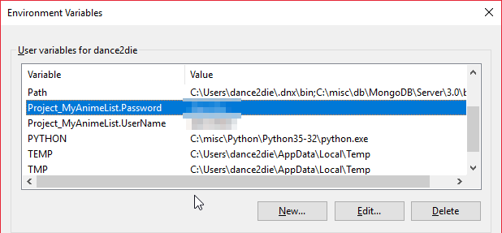

You have come up with a cool idea, decided to make an open source project, and share it on [GitHub](https://github.com/).

The most popular language on GitHub nowadays is [JavaScript](http://githut.info/), and many of those who use JavaScript access Web API.

Most of Web APIs nowadays require developer API key, but your "Open Source" project source is made public as the name suggests.

Now the question is, how can we hide the API keys?

### Hide Using .gitignore File

Since JavaScript is most common language, I will talk about how to hide API keys for a web project.

Create an external JavaScript file: Name it however you want but I usually use apiKeys.js.

Add an object containing API keys and export it.

gist:dance2die/77064be53f74977d3acbf6c1460cfee3

Add an entry in `.gitignore` the name of file you created.

gist:dance2die/9d65b4319aa0e204401f89bb66be9613

You can now access API keys in other JavaScript files simply by importing/requiring it.

gist:dance2die/52b8031861bd358f7cb30e20b85b6a33

> ##### Advantage
> 
> It's easy to migrate between machines since all that's required is to copy files from machine to machine.
> 
> ##### Disadvantage
> 
> Each web project requires its own copy of API keys and it's not easy to sync unless the file is shared in a common location.

 

### Hide Using a Partial Class

Now for a back-end language, I will use C# as an example since I am most familiar with it.

C# has a concept of [_partial class_](https://docs.microsoft.com/en-us/dotnet/csharp/programming-guide/classes-and-structs/partial-classes-and-methods).  Partial classes are used widely for adding new functionalities to codes that are generated by tools without the tool overwriting it.

You can use this concept to create a partial class that contains API keys exposed as properties.

First step is to create a partial class, and commit to GitHub without adding API key properties.

And then you mark the partial class file as not updatable using git.

I have learned of this method after reading a [gist](https://gist.github.com/aloisdg/38a6a09b614d8455b6d1e685a77a5eba) posted by [Alois](https://github.com/aloisdg) on GitHub.

> ##### Advantage
> 
> Re-usability of partial class within a solution.
> 
> ##### Disadvantage
> 
> Steps involved is a bit cumbersome and it's language dependent.

 

### Hide Using Environment Variables

The last method is to use _environment variables_. Create new environment variables per each key and access it from your code.

First, create environment variables for your system (I am using Windows 10 as an example here).

I created `Project_MyAnimeList.Password` & `Project_MyAnimeList.UserName`.

 

 

 

 

 

 

 

 

 

In your code, simply access environment variable to fetch secret information ([CredentialContext.cs](https://github.com/dance2die/MyAnimeListSharp/blob/master/Project.MyAnimeList/Project.MyAnimeList/Auth/CredentialContext.cs)).

gist:dance2die/1efad8bdf3f3ae4217fd1aadc5423b8d

> ##### Advantage
> 
> It's easy easily shareable/accessible from several different projects from a computer.
> 
> ##### Disadvantage
> 
> If you are working on a project using the environment variable from different machines (work computer and laptop at home), you need to create environment variable in each of those machine. It's harder than just copying files from machine to machine

As a side note, I chose environment variable option for [MyAnimeListSharp](https://github.com/dance2die/MyAnimeListSharp) because the project was developed only on my laptop while working on different branches.

 

** Update **

[Jamie Taylor](https://www.gaprogman.com/) kindly explained to me on [CodingBlocks Slack Channel](https://www.codingblocks.net/slack/) that .NET Core has a built-in support for storing and accessing configuration secrets.

Check out this Microsoft Documentation, [Safe storage of app secrets during development](https://docs.microsoft.com/en-us/aspnet/core/security/app-secrets).

 

### Takeaway

There is no one method that's better than the other. Choose a different method of hiding API keys depending on your current situation.
