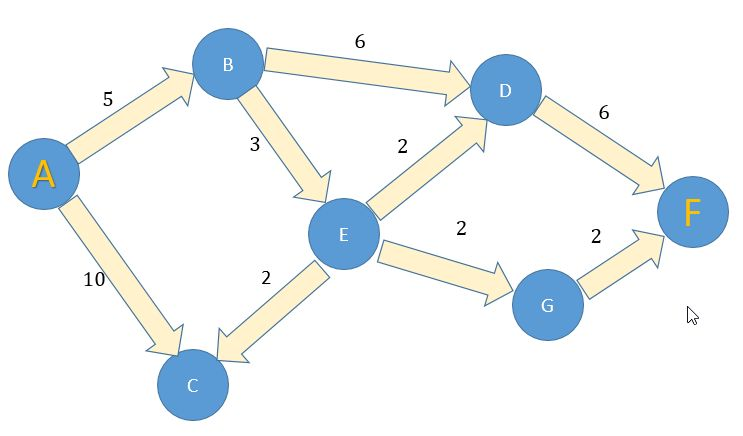
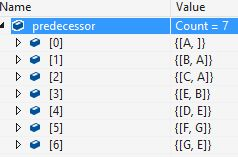

I've already [implemented Dijkstra's algorithm](https://www.slightedgecoder.com/2017/04/20/my-journey-on-implementing-dijkstras-algorithm/) and was looking for another way to find the shortest path between two nodes in a graph. I found a simpler algorithm based on relaxation called "Bellman-Ford" algorithm.

I just implemented the algorithm in C# and would like to share it.

I had many troubles implementing Dijkstra's algorithm because I didn't have a good understanding of how it worked. So this time, I watched more videos on the Bellman-Ford algorithm to grasp the idea behind it.

Here are the videos I found helpful.

- [Bellman-Ford in 4 minutes — Theory](https://www.youtube.com/watch?v=9PHkk0UavIM)
- [Bellman-Ford in 5 minutes — Step by step example](https://youtu.be/obWXjtg0L64)

Watch the Theory video first before diving into example video.

Theory and examples behind Bellman-Ford are very well explained in the videos and on [Wikipedia ](https://en.wikipedia.org/wiki/Bellman–Ford_algorithm)so I won't go over them. I will only show a concrete implementation in C#. The implementation is based purely on algorithm listed in Wikipedia.

**Wikipedia Pseudo Code**

This is the pseudo code I will base my implementation.

```
function BellmanFord(list vertices, list edges, vertex source)
   ::distance[],predecessor[]

   // This implementation takes in a graph, represented as
   // lists of vertices and edges, and fills two arrays
   // (distance and predecessor) with shortest-path
   // (less cost/distance/metric) information

   // Step 1: initialize graph
   for each vertex v in vertices:
       distance[v] := inf             // At the beginning , all vertices have a weight of infinity
       predecessor[v] := null         // And a null predecessor

   distance[source] := 0              // Except for the Source, where the Weight is zero

   // Step 2: relax edges repeatedly
   for i from 1 to size(vertices)-1:
       for each edge (u, v) with weight w in edges:
           if distance[u] + w < distance[v]:
               distance[v] := distance[u] + w
               predecessor[v] := u

   // Step 3: check for negative-weight cycles
   for each edge (u, v) with weight w in edges:
       if distance[u] + w < distance[v]:
           error "Graph contains a negative-weight cycle"
   return distance[], predecessor[]
```

Before showing my implementation, I need to show you the data structure of Graph and its associated classes, Node, and Edge because the declaration of the implementing method looks different from that of the pseudo code.

Here is my _Graph_ data structure.

```csharp
public class Graph<T>
{
	public List<Node<T>> Nodes { get; set; }

	public Dictionary<Node<T>, Edge<T>> Vertices { get; } = new Dictionary<Node<T>, Edge<T>>();

	public void AddVertex(Node<T> node, Edge<T> edges)
	{
		if (!Vertices.ContainsKey(node))
			Vertices.Add(node, edges);
	}
	...
}
```

And _Node_ class representing a node in a graph.

```csharp
public class Node<T>
{
	public T Value { get; set; }

	public Node(T value)
	{
		Value = value;
	}
...
}
```

And also, my implementation of the graph has a class called "Edge" which is a line between two nodes and contains a weight and a linked node.

```csharp
public class Edge<T>
{
	public int Weight { get; set; }
	public Node<T> Node { get; set; }

	public Edge(int weight, Node<T> node)
	{
		Weight = weight;
		Node = node;
	}
...
}
```

#### Actual Implementation

Here is the implementing method definition.

```csharp
public Tuple<Dictionary<Node<T>, int>, Dictionary<Node<T>, Node<T>>>
 GetPathInfoUsingBellmanFordAlgorithm(Node<T> sourceNode)
```

Currently, the method `GetPathInfoUsingBellmanFordAlgorithm` belongs to "Graph" (I will refactor it later), which contains vertices and edges so only "sourceNode" is passed to it (thus leaving out "vertices" and "edges" parameter declarations in pseudo code).

`::distance[],predecessor[]` is implemented as two dictionaries as shown.

```csharp
var distance = new Dictionary<Node<T>, int>();
var predecessor = new Dictionary<Node<T>, Node<T>>();
```

_distance_ represents distances from source to the node being checked while _predecessor_ holds paths between nodes.

Each step in pseudo code is implemented as following.

**Step 1: initialize graph**

```csharp
// Step 1: initialize graph
foreach (KeyValuePair<Node<T>, Edge<T>> vertex in this.Vertices)
{
// At the beginning , all vertices have a weight of infinity
distance[vertex.Key] = int.MaxValue;
// And a null predecessor
predecessor[vertex.Key] = null;

    // initialize nodes in edges
    foreach (var edge in vertex.Value)
    {
    	distance[edge.Node] = int.MaxValue;
    	predecessor[edge.Node] = null;
    }

}
// Except for the Source, where the Weight is zero
distance[sourceNode] = 0;
```

Notice that I am initializing all vertices as well as nodes associated with each vertex because my implementation of _vertices_ contains only vertices that have an outbound link(s) to another node.

The code is not yet optimized (since each edge can contain nodes that are already initialized) for demonstration purposes only to show 1 to 1 matching between my implementation and the Wikipedia pseudo code.

**Step 2: relax edges repeatedly**

```csharp
// Step 2: relax edges repeatedly
for (int i = 1; i < this.Vertices.Count; i++)
{
foreach (KeyValuePair<Node<T>, Edge<T>> vertex in this.Vertices)
{
var u = vertex.Key;
foreach (Edge<T> edge in vertex.Value)
{
var v = edge.Node;
var w = edge.Weight;

    		if (distance[u] + w < distance[v])
    		{
    			distance[v] = distance[u] + w;
    			predecessor[v] = u;
    		}
    	}
    }

}
```

In the pseudo code, there are only two for loops but the implementation has three due to the not-so-optimal data structure.

**Step 3: check for negative-weight cycles**

```csharp
// Step 3: check for negative-weight cycles
foreach (KeyValuePair<Node<T>, Edge<T>> vertex in this.Vertices)
{
var u = vertex.Key;
foreach (Edge<T> edge in vertex.Value)
{
var v = edge.Node;
var w = edge.Weight;

    	if (distance[u] + w < distance[v])
    		throw new InvalidOperationException("Graph contains a negative-weight cycle");
    }

}
```

As it was the case for step 2, this implementation has additional "foreach" loop to iterate over each edge in each vertex.

**Step 4: return result**

return Tuple.Create(distance, predecessor);

Since C# doesn't allow returning multiple values from a method, I am returning the distance and the predecessor as a tuple. I will refactor it later wrapping the result in another class object.

Now the question is, **how do you determine the shortest path between two nodes** from the return value?

#### Finding the shortest path

One of the return values, _predecessor_, contains information on how to traverse between two nodes.

Let's use this weighted graph as an example (Example is from [this YouTube video](https://youtu.be/zXfDYaahsNA).)



The shortest path between "A" and "F" is "A->B->E->G->F".

The _predecessor_ returned by the method, `GetPathInfoUsingBellmanFordAlgorithm` looks like this.



To find the shortest path, we need to traverse from the destination back to the source node.

So when we start from 6th item(where index is 5 {[F,G]}), the value in the dictionary is "G". Next, we look for an item where "G" is the key in the predecessor. We find that the 7th item ({[G,E]}) has "G" as the key. Then iterate until we reach the source node, "A". Since we are traversing backward, it seems like a stack would do the job to return the result in LIFO order.

The implementation of a method that returns the shortest path looks like this.

```csharp
public List<Node<T>> GetShortestPathUsingBellmanFordAlgorithm(Node<T> fromNode, Node<T> toNode)
{
// Get the predecessor
Tuple<Dictionary<Node<T>, int>, Dictionary<Node<T>, Node<T>>> pathInfo =
 GetPathInfoUsingBellmanFordAlgorithm(fromNode);
var predecessors = pathInfo.Item2;

    // Initialize the stack with start node, which is the destination
    Stack<Node<T>> result = new Stack<Node<T>>();
    var startNode = toNode;
    result.Push(startNode);

    // Traverse the predecessor hashtable until we find
    do
    {
    	var node = predecessors[startNode];
    	result.Push(node);

    	// if we reached the source, then we are done.
    	if (node.Value.Equals(fromNode.Value)) break;

    	// Move to the next node
    	startNode = node;
    } while (true);

    return result.ToList();
}
```

After the getting the predecessor from "GetPathInfoUsingBellmanFordAlgorithm", the code simply traverses the predecessor hash table in reverse order and stores each step in a stack.

I can't stress enough that the code is not production ready because it's just a demo implementation. The full source is available on [GitHub](https://github.com/dance2die/Demo.LearnByDoing/tree/master/Demo.LearnByDoing.General/Algorithms/Graph). You can copy it, modify it, use it, distribute it any way you want/need to.

### Conclusion

I've described how Bellman-Ford algorithm is implemented in C#.  I am planning to refactor it to be more readable and structure the code properly and will push the updated code on GitHub.

