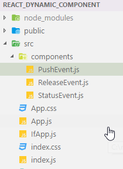
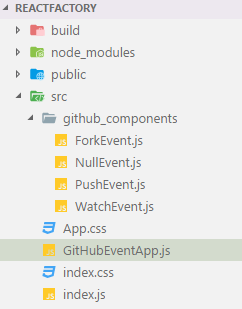
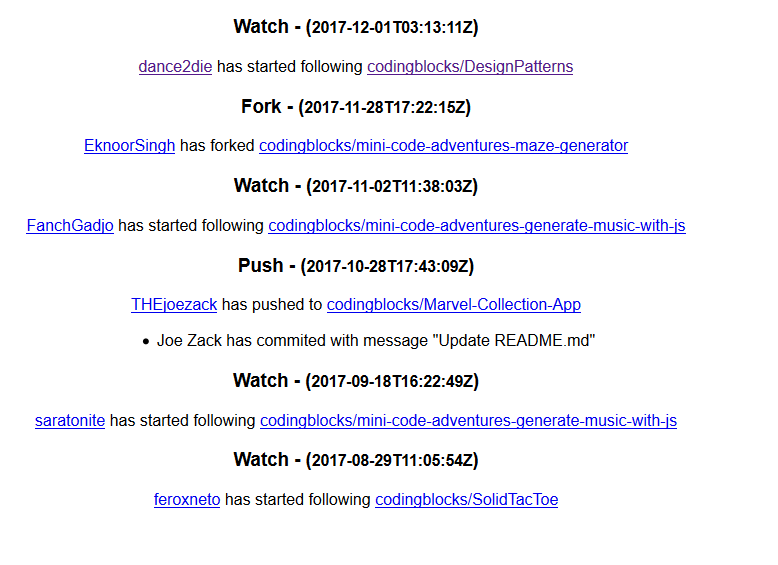
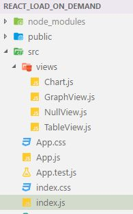

### **UPDATE** - October 28, 2018

Refer to the updated post, [Loading React Components Dynamically on Demand using React.lazy](https://sung.codes/blog/2018/10/28/loading-react-components-dynamically-on-demand-using-react-lazy/) if you are using `v16.6.0+`.

* * *

I was looking for implementations for a [Factory Pattern](https://en.wikipedia.org/wiki/Factory_method_pattern) in JavaScript to get rid of a `switch` statement when displaying React components.

Then I ran into a dynamic [import()](https://hospodarets.com/native-ecmascript-modules-dynamic-import).

I will show you 3 ways to use `import()` to dynamically load React Components.

1. [Loading React Components Dynamically](#case1) - [Demo](https://epic-chandrasekhar-a99744.netlify.com/) - [Source Code](https://github.com/dance2die/Demo.React.ReactDynamicComponent)
2. [Handling Different Data Types](#case2) - [Demo](https://pedantic-goldstine-aff0e1.netlify.com/) - [Source Code](https://github.com/dance2die/Demo.React.ReactDynamicImport)
3. [Loading Components on Demand](#case3) - [Demo](https://hardcore-fermi-db1121.netlify.com/) - [Source Code](https://github.com/dance2die/Demo.React.ReactLoadOnDemand)

Let's dive in 🏊~

### Case 1 - Loading React Components Dynamically

#### **Problem**

Suppose that you want to display differently for each event in an events array.

`gist:dance2die/630c7839758da7e0eb6dbd6c662e83e7`

Within `IfApp.render()`, one would use a `if/switch` statement to check what type of event it is and create a component as shown below.

`gist:dance2die/d0d80c06611346270116072d600f81ec`

There are **two** issues with this approach.

1. it quickly becomes a maintenance nightmare as new event gets created.
2. We are importing components even if we don't need it

#### Alternative Approach

We can mitigate the problem if

1. We can import dynamically only the components we need, and
2. also make it easier to maintain by getting rid of switch statement.

I will use `import()` statement to dynamically load event component (Please refer to this [excellent article](https://hospodarets.com/native-ecmascript-modules-dynamic-import) by [Serg Hospodarets](https://twitter.com/malyw) for  `import()` ).

Here is the demo code structure.

 

 

 

Here is the method to add a component by type name ("PushEvent", "ReleaseEvent", and "StatusEvent").

`gist:dance2die/8ee075b26528ed72f61ffaecec891ea1`

Given a type name, `addComponent()` imports a component file and adds it to `this.state.components`.

And also, if an unknown type is passed, it displays an error message in console.

And the method is called for each type within `componentDidMount()`.

`gist:dance2die/d33f5dee1d59b04c87411c9e20551559`

We render imported components as shown below.

`gist:dance2die/38d1a142aac8cb42770cc1589d2fb8cc`

_Note that you need to have a unique key for each `Component` object instance, so I used [shortid](https://www.npmjs.com/package/shortid) to generate unique key for each component._

The full source for `App` component is shown below.

`gist:dance2die/95259efdf4f883f1ceae62ca1346734a`

Now the `switch` statement within `render()` is gone and `App` doesn't need to change when a new type is added (refer to [Open-Close Principle](https://en.wikipedia.org/wiki/Open/closed_principle)). When a new type is added, we just need to create a new component under `components` folder.

And also, scripts get loaded dynamically as shown in the video below.

https://www.youtube.com/watch?v=woficvbpOs0&feature=youtu.be

[Live Demo](https://epic-chandrasekhar-a99744.netlify.com/) on Netlify

### Case 2 - Handling Different Data Types

Let's take a look at more advanced scenario. Now each type is associated with data having different schema.

`gist:dance2die/d086b0012e198bfb3bb5ac9062a0bb39`

It's from an actual response from a public [GitHub API call](https://api.github.com/users/codingblocks/events/public).

There are [37 types of events](https://developer.github.com/v3/activity/events/types/), which one having slightly different response schema.

As it was the case in the Case 1, we could simply create an GitHub event handler component and let each one deal with different type of payload data.

First, the code structure looks like this.

 

 

 

 

 

 

 

 

We pass the JSON response to `GitHubEventApp` like following.

`gist:dance2die/8fc8e6e8d0b85392bfd6e8bf8d9bbbb5`

Then we load components for each event in `componentDidMount()`.

`gist:dance2die/bb657a5c14121429cabbeee4c922860d`

Two things are worth mentioning here;

1. I am instantiating `Component` within `this.setState`. It is because to make component sorting easier later in `render()`(I'd appreciate it if anyone let me know instantiating here instead of in `render()` would cause a performance issue or not).
2. I am passing all event properties while instantiating a component (Each dynamically imported components can pick and choose props to use).

`gist:dance2die/b5c44b3cca537caebe635ae32c66502f`

Now let's render the result in descending order (higher the ID, the later the event was created).

`gist:dance2die/87c20876004c92c90bb5e536f90d4873`

Here is the glorious result 🎉🎉🎉 (Please pardon the appearance...)

You can see that each event are rendered differently.

Component codes are listed here for the sake of completeness.

[Live Demo](https://pedantic-goldstine-aff0e1.netlify.com/) on Netlify

`ForkEvent.js`

`gist:dance2die/8b2d9681ce05983cddaa5b6e8fbcb3d5`

`NullEvent.js`

`gist:dance2die/846e44d308a5455adf5df529f0f2b597`

`PushEvent.js`

`gist:dance2die/d66860879a25f39701c663d80035e1a0`

`WatchEvent.js`

`gist:dance2die/4fcdd430a41103986adfc616ce666f31`

 

### Case 3 - Loading Components on Demand

The last case is when we want to display different views for the same input.

Suppose that given data, you can show it as a tabular form or as a graph.

Code structure looks like this.

 

 

 

 

 

 

 

 

Here is the shared data we want to display in **tabular** and/or **graph** representations.

`gist:dance2die/b5662196399a477f53e8f8c18d4ed76a`

Here is how the result looks before digging into the implementation (Please pardon my CSS skills _again_).

https://www.youtube.com/watch?v=aereCCBwn1o&feature=youtu.be

 

[Live Demo](https://hardcore-fermi-db1121.netlify.com/) on Netlify

`App` component initializes state with following properties.

`gist:dance2die/b97b10aedb4760cde63b979069cdebd4`

1. `loadedComponents` tracks what components have been added as not to load more than once.
2. `components` holds view components (tabular or graph).

`render()` simply has 3 buttons and handles the click event.

`gist:dance2die/61360a0af8de638275743027dc979408`

Each `onClick` events handlers adds a different view.

`gist:dance2die/9ad874a3950cfdc0412116d242db0094`

`addView` imports a new view component by view name.

`gist:dance2die/38b39a57eecb9efd86ec8220bda5081b`

Here are the views components.

`TableView.js` - Formats data using HTML table.

`gist:dance2die/415c53ec7475ebb066373983c93ccc1e`

`GraphView.js` - Formats data graphically.

`gist:dance2die/bdce8b2e3e0948235d691fcebdbbb3ab`

`NullView.js` - Does nothing.

`gist:dance2die/1d2dae335321abda5d426dd0b52a17b2`

### Parting Words

I've discussed three cases.

1. [Loading React Components Dynamically](#case1) - [Demo](https://epic-chandrasekhar-a99744.netlify.com/) - [Source Code](https://github.com/dance2die/Demo.React.ReactDynamicComponent)
2. [Handling Different Data Types](#case2) - [Demo](https://pedantic-goldstine-aff0e1.netlify.com/) - [Source Code](https://github.com/dance2die/Demo.React.ReactDynamicImport)
3. [Loading Components on Demand](#case3) - [Demo](https://hardcore-fermi-db1121.netlify.com/) - [Source Code](https://github.com/dance2die/Demo.React.ReactLoadOnDemand)

I'd appreciate it if you can point out any optimizations or improvements I can make.

