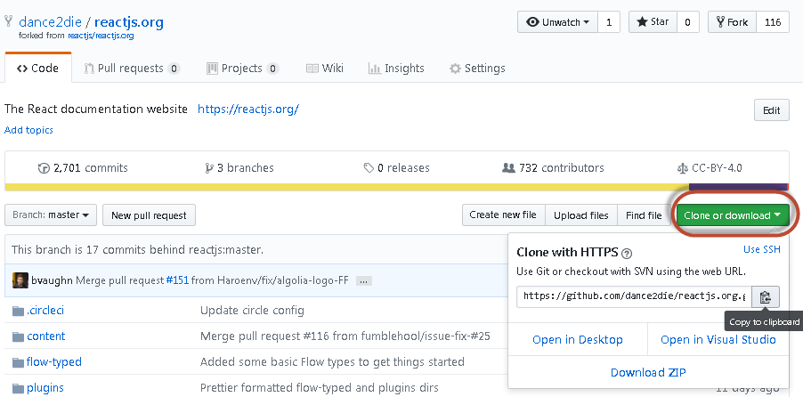
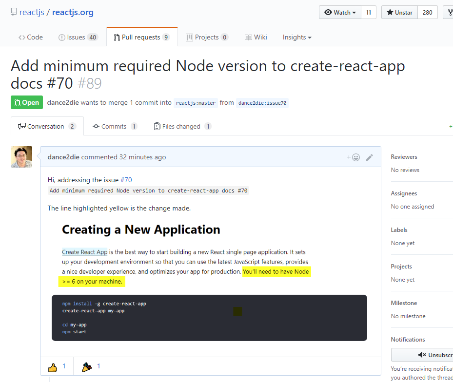
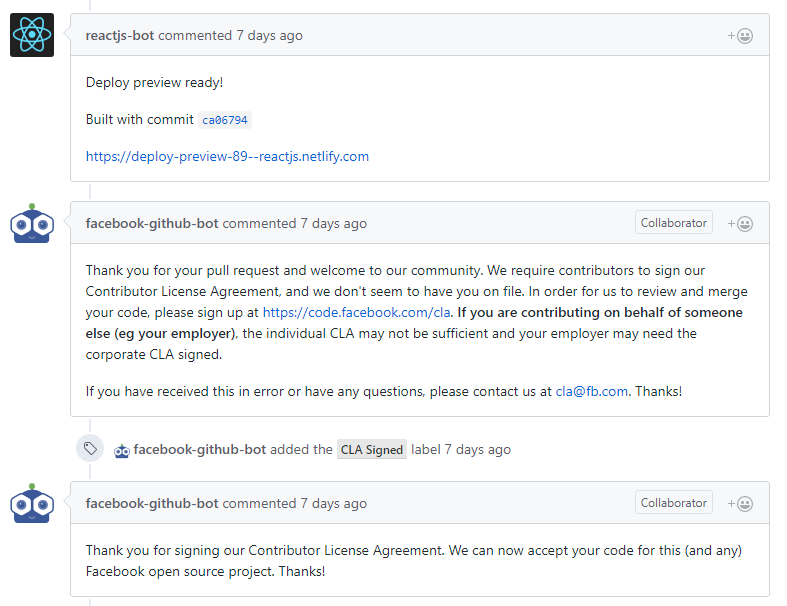
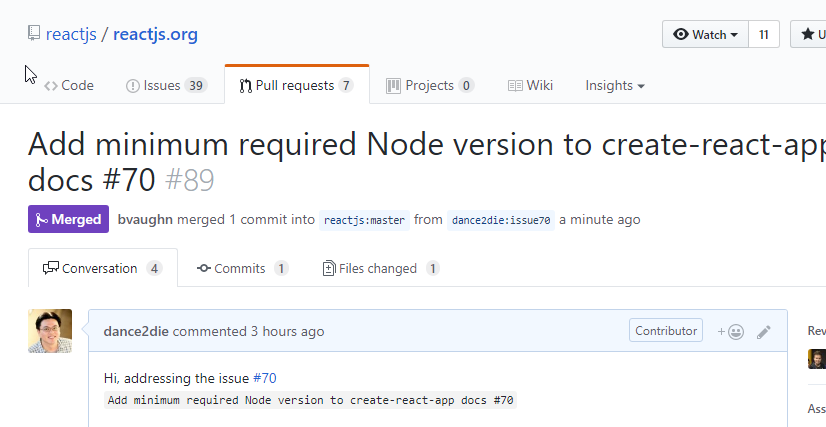
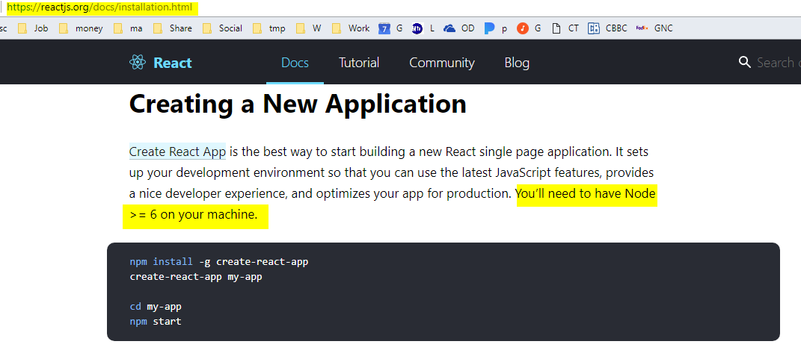

I wanted to contribute to [ReactJS.org](https://reactjs.org/) website, (which is a new React JS documentation site announced on [Twitter](https://twitter.com/reactjs/status/913797391307833344).) as a happy new React user.

Setting up ReactJS.org environment on Windows slightly challenging but quite worth it.

I'd like to show you how to get ReactJS.org page up and running on Windows 10.

### TL;DR

> Download source code, install NPM packages and verify the site works.

### Initial Steps - Download source code

1. Create a fork of ReactJS.org on GitHub.
    1. Go to [ReactJS.org GitHub page](https://github.com/reactjs/reactjs.org/).
    2. Create a new fork by clicking on the `Fork` button on the right.
2. Go to newly created fork
    1. https://github.com/<<YOUR\_GITHUB\_ID>>/reactjs.org/
3. Clone the fork
    1. by copying the repository path and,
        1. 
        2. and running `git clone` command - `git clone https://github.com/<<YOUR_GITHUB_ID>>/reactjs.org.git`
        3. Go to the cloned directory - `cd reactjs.org`
4. Check out a branch - `git checkout -b <<branch name>>`

gist:dance2die/bf779008e0f845c455cef456b1922bf7

### Node-Gyp NPM package installation issue

Now you got the source, let's install NPM packages using `yarn`.

But it will fail due to [node-gyp](https://github.com/nodejs/node-gyp) issue.

gist:dance2die/4485bcc2f0843bf542df262cc1b2b35c

(In my case, I was missing Python 2.7)

"node-gyp" is required to run ReactJS.org. Luckily Node-Gyp [Windows documentation](https://github.com/nodejs/node-gyp#on-windows) provides two ways to install it.

1. [Using NPM](https://github.com/nodejs/node-gyp#option-1)
2. [Manually install dependencies and configure](https://github.com/nodejs/node-gyp#option-2)

I recommend using NPM command since it's easier.

After successfully installing "node-gyp", run `yarn` again and it will install packages without an issue.

gist:dance2die/ddee3b8f2647026f755584d3dad1feff

### Verify that the site works

Now to verify you need to run `yarn check-all`, which you need to run after making changes to the site.

But let's run it to make sure that the site is working.

gist:dance2die/a0581e3fc9a2fa9a0732b706b39b9da0

 

After making a change to the source code (pick and choose any [issues](https://github.com/reactjs/reactjs.org/issues) you can work on),

### Create a Pull Request (PR)

A [Pull Request (PR)](https://yangsu.github.io/pull-request-tutorial/) is a way of notifying the repository owner to merge your change into their source tree.

After a code change, stage it and commit it.

gist:dance2die/f5b297ff26fe50e64ef0af1036f77e7f

Be as descriptive for the commit message by adding URL and what's fixed as well as issue # you were working on.

Now, push the change to your fork.

gist:dance2die/894a2e9cdf4dc367219c21f044da3fbe

Push steps are [documented](https://github.com/reactjs/reactjs.org/#push-it) on ReactJS.org page.

If everything went well, go to GitHub fork page and create a PR. If you are not unsure how to, refer to the official GitHub documentation, [Creating a pull request - User Documentation](https://help.github.com/articles/creating-a-pull-request/).

After generating a PR, you will see a PR on ReactJS.org Pull requests tab.

Make sure to include a screenshot of what's changed in your PR if your change is cosmetic.

Not long after your PR is created, a Facebook bot will ask you to sign a [Contributor License Agreement](https://code.facebook.com/cla).

After you sign the agreement, the bot will verify and leave another comment in about an hour.

Once your change is accepted, it will be merged.

**Congratulations!** You've contributed to reactjs.org webpage! (I am not exactly sure how long it takes for the PR to go live, yet. Let me know if you know the cycle.)

### Conclusion

Sorry to scare you in the beginning of the post. But it's actually as easy as forking a repository, install NPM packages, make a change, and create a PR.

This post is based on the [feedback](https://github.com/reactjs/reactjs.org/issues/70#issuecomment-335047497) I left on GitHub after being asked by [Brian Vaughn](http://www.briandavidvaughn.com/).

 

update on 10/16/2017

`yarn check-all` now [works on Windows](https://github.com/reactjs/reactjs.org/pull/166), so that part of the post is removed, thus easier to set up now.
