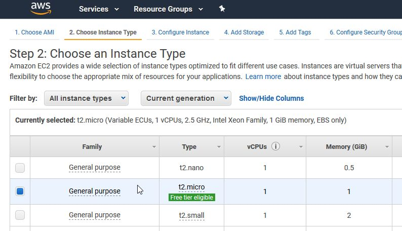
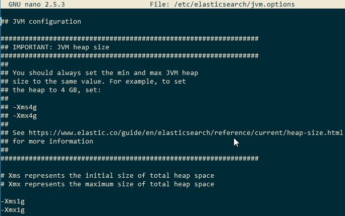
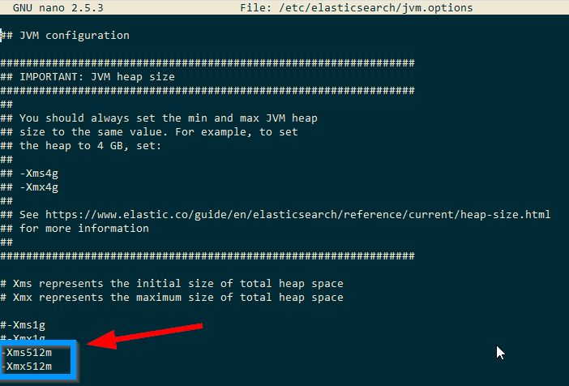

I installed Elasticsearch **6**.x on a free tier AWS EC2 instance type, `t2.micro` by following [installation instruction](https://medium.com/@adnanxteam/how-to-install-elasticsearch-5-and-kibana-on-homestead-vagrant-60ea757ff8c7) (for Elasticsearch **5**) by [Adnan Sabanovic](https://medium.com/@adnanxteam) on medium.

Adnan used a [cURL](https://en.wikipedia.org/wiki/CURL) command to check if Elasticsearch is running or not.

gist:dance2die/3dff7c0c45c8fb6e18f3b73a4dbcd316

But then the command returned the following error message.

> curl: (7) Failed to connect to localhost port 9200: Connection refused

What happened?

### Diagnosis

Let's see the status of Elasticsearch by running `systemctl` comamnd.

gist:dance2die/b7e815a3a4e3be3f46dbc92299e7d1c7

On line #9, you can see the warning "OpenJDK 64-Bit Server VM warning" and the line #10 shows that the Elasticsearch service main process has existed right away.

### Updating Elasticsearch 6.x JVM Heap Size

By default Elasticsearch 6.x JVM Heap size set to use minimum 1Gig of memory.

`t2.micro` has 1Gig of memory

but Elasticsearch [documentation recommends](https://www.elastic.co/guide/en/elasticsearch/reference/current/heap-size.html) to set it to 50% of physical memory for kernel file system caches.

We know the problem, so let's change the Elasticsearch JVM heap size.

Open `/etc/elasticsearch/jvm.option` using an editor of your choice (I promise that I will learn either vi or emacs... 😞).

gist:dance2die/f54076253a6aa402d7fa2ebffa8d2d5d

When you read the comment in `jvm.options`, you should set the minimum and maximum to the same value.

And you can see that the min and max JVM heap sizes are set to 1g on the bottom of above image.

> \-Xms1g
> 
> \-Xmx1g

Now update the min and max values to 512m, save the file and exit.

### Restart and Test

Restart Elasticsearch service,

gist:dance2die/3db44a114a46b8dfa252027f4e1f9a11

and run the cURL command again.

🎉Tada 🎉, Elasticsearch is now running on AWS EC2 t.micro instance.
