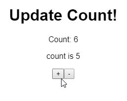

_Photo by _[_Martino Pietropoli_](https://unsplash.com/photos/H8zix6ErdXg?utm_source=unsplash&utm_medium=referral&utm_content=creditCopyText)_ on _[_Unsplash_](https://unsplash.com/search/photos/serial?utm_source=unsplash&utm_medium=referral&utm_content=creditCopyText)

_**Note 📝 to self...**_

When you have more than one states defined using `useState` and need to access updated state value sync-like manner...

I've asked [a question](https://www.reddit.com/r/reactjs/comments/a2oxbv/beginners_thread_easy_questions_december_2018/eb06q9v/) in r/reactjs about emulating a [callback of setState](https://reactjs.org/docs/react-component.html#setstate), which enables you to access updated state value.

Shawn "[swyx](https://twitter.com/swyx)" Wang posted [React Hooks setState Gotcha](https://www.reddit.com/r/reactjs/comments/a3y76f/react_hooks_setstate_gotcha/), which addressed the same problem.

The problem is that `useState` is an async method just like `setState` so that when you try to access a state value as shown below,

`gist:dance2die/35416648292313d931c7bd6efb930fb8`

<a href="https://gist.github.com/dance2die/35416648292313d931c7bd6efb930fb8">View this gist on GitHub</a>

Buggy 🐛 one

_Try it on_ [_CodeSandbox_](https://codesandbox.io/s/o2p0zpmyq)_._

`message` value will always contain a number differ by 1 from `count`.

Count & message off by one

## First Workaround

The first workaround was to use `useEffect` to update the message.

`gist:dance2die/a56bf566c110d0e74ac0696142ef8543`

<a href="https://gist.github.com/dance2die/a56bf566c110d0e74ac0696142ef8543">View this gist on GitHub</a>

useEffect

But Dan "gaeron" Abramov has [pointed out](https://www.reddit.com/r/reactjs/comments/a3y76f/react_hooks_setstate_gotcha/ebaced5/) that

> This is unnecessary. Why add extra work like running an effect when you already know the next value? Instead, the recommended solution is to either use one variable instead of two (since one can be calculated from the other one, it seems), or to calculate next value first and update them both using it together. Or, if you're ready to make the jump, `useReducer` helps avoid these pitfalls.
>
> Dan "gaeron" Abramov

The gist is that, **_don't store calculated values_**.

## 2nd Workaround

The point of the Shawn & my problem was that we need to access the updated state value (kind of like in callback of `setState`).

So I ended up created my own hook (don't call it a "custom hook"), `useAsyncState` to mitigate the issue.

`gist:dance2die/00383f3d98e62099b5ae1eefbd0913b8`

<a href="https://gist.github.com/dance2die/00383f3d98e62099b5ae1eefbd0913b8">View this gist on GitHub</a>

useAsyncState

_Try it on_ [_CodeSandbox_](https://codesandbox.io/s/8y05v1vx3j)_._

I am using a promise, not accepting a callback as it makes code clunky possibly causing a callback hell.

And also with a setter promise, you can also use `async/await` syntax.
