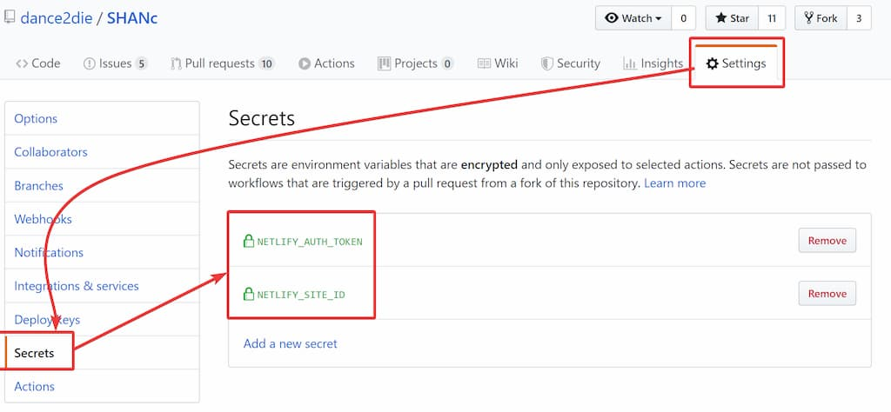
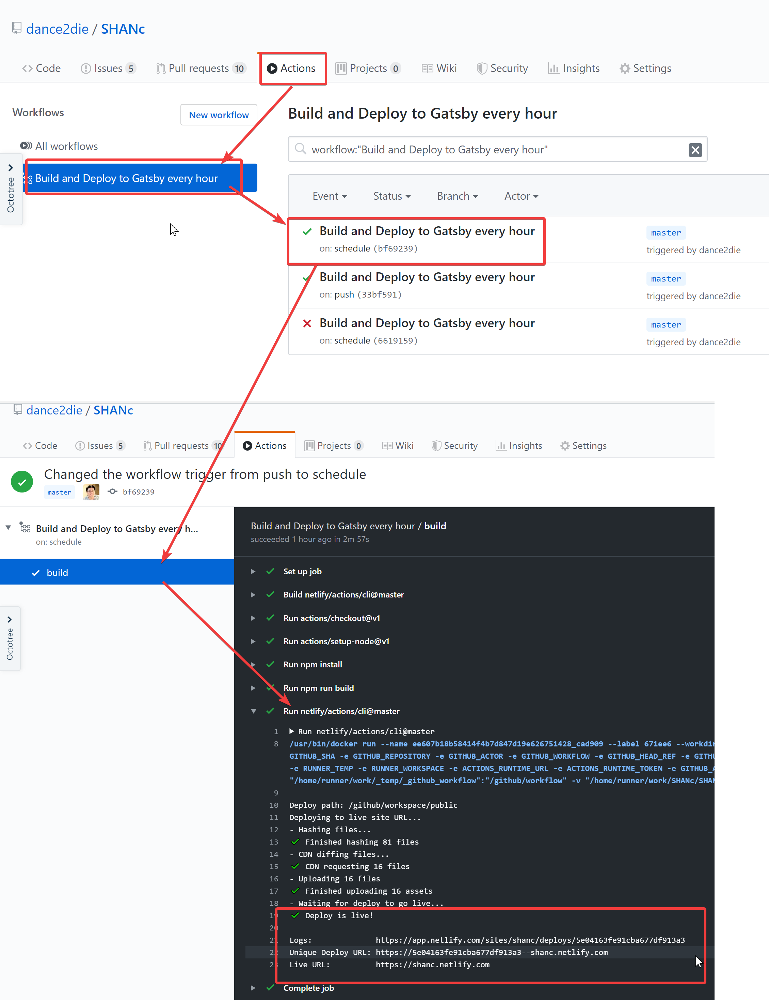
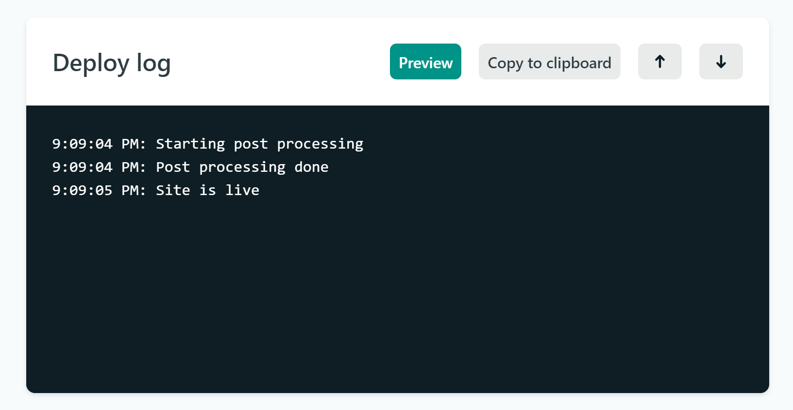
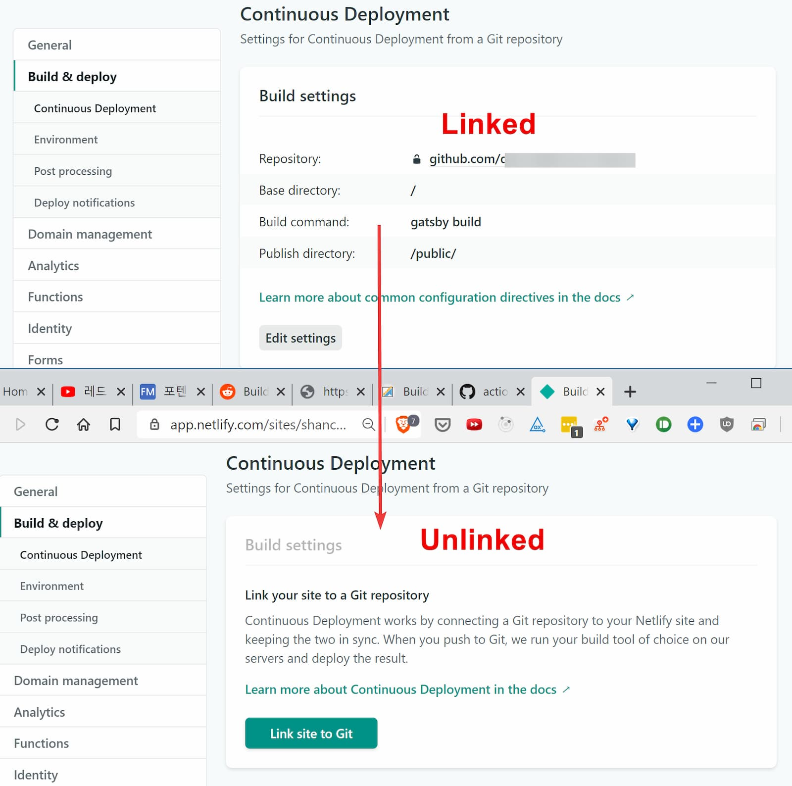

Netlify introduced [build minutes](https://www.netlify.com/pricing/faq/) (300 minutes for the free tier, 1000 for the pro account), which limits build time on their site.

Thankfully, Netlify community support has provided a guideline, [How can I optimize my Netlify build time?](https://community.netlify.com/t/common-issue-how-can-i-optimize-my-netlify-build-time/3907), with many tips.

You can shave off the build time by delegating the build minutes to GitHub Actions by building and deploying directly to Netlify.

---

## Preface

I am writing this while learning about GitHub Actions, so let me know should you find any errors. :)  
If you want to know more about GitHub Actions, check out the official [GitHub Actions documentation](https://help.github.com/en/actions).

## Creating a Workflow file

Refer to [Configuring a workflow](https://help.github.com/en/actions/automating-your-workflow-with-github-actions/configuring-a-workflow).

## Workflow Definition

Below is the complete [GitHub workflow in YAML](https://github.com/dance2die/SHANc/blob/master/.github/workflows/build-hourly-deploy-to-netlify.yml) for building a Gatsby site, and deploying to Netlify every 2 hours.

```yaml
name: Build and Deploy to Gatsby every two hours

on:
  # 1. Trigger the workflow every 2 hours
  schedule:
    - cron: "0 */2 * * *"

jobs:
  build:
    # 2. Using the latest Ubuntu image
    runs-on: ubuntu-latest

    steps:
      # Check out the current repository code
      - uses: actions/checkout@v1
      # 3. https://github.com/actions/setup-node#usage
      - uses: actions/setup-node@v1
        with:
          node-version: "12.x"
      - run: npm install
      # This triggers `gatsby build` script in "package.json"
      - run: npm run build
      # 4. Deploy the gatsby build to Netlify
      - uses: netlify/actions/cli@master
        env:
          NETLIFY_AUTH_TOKEN: ${{ secrets.NETLIFY_AUTH_TOKEN }}
          NETLIFY_SITE_ID: ${{ secrets.NETLIFY_SITE_ID }}
        with:
          # 5. "gatsby build" creates "public" folder, which is what we are deploying
          args: deploy --dir=public --prod
          secrets: '["NETLIFY_AUTH_TOKEN", "NETLIFY_SITE_ID"]'
```

1. `cron` schedule triggers the workflow [every two hours](https://crontab.guru/#0_*/2_*_*_*)
1. In the tatest version of Ubuntu image,
1. NPM packages are installed & built using Node version 12.x.
1. Then using the [official Netlify's GitHub Actions Netlify-CLI](https://github.com/netlify/actions/tree/master/cli), the site is deployed.
1. Deploy `public` folder, generated by `gatsby build`.

## Secret Environment Variables

Deploying to Netlify with Netlify CLI requires a [personal access token](https://docs.netlify.com/cli/get-started/#obtain-a-token-in-the-netlify-ui), `NETLIFY_AUTH_TOKEN` (and an [optional site ID](https://docs.netlify.com/cli/get-started/#link-with-an-environment-variable), `NETLIFY_SITE_ID`).

_But You should never expose your API keys, ever, period._

Thankfully, GitHub provides a way to [create secret environment variables](https://help.github.com/en/actions/automating-your-workflow-with-github-actions/creating-and-using-encrypted-secrets), which you can pass to the workflow definition.



You now need to declare the environment variables, and pass it to the CLI.

<!-- prettier-ignore -->
```yaml
        env:
          NETLIFY_AUTH_TOKEN: ${{ secrets.NETLIFY_AUTH_TOKEN }}
          NETLIFY_SITE_ID: ${{ secrets.NETLIFY_SITE_ID }}
        with:
          # 5. "gatsby build" creates "public" folder, which is what we are deploying
          args: deploy --dir=public --prod
          secrets: '["NETLIFY_AUTH_TOKEN", "NETLIFY_SITE_ID"]'
```

I wasn't aware of [an alternative syntax](https://github.com/netlify/actions/blob/master/cli/README.md#example) to declare the workflow, and had hard time with passing the secrets.

```
workflow "Publish on Netlify" {
  on = "push"
  resolves = ["Publish"]
}

action "Publish" {
  uses = "netlify/actions/cli@master"
  args = "deploy --dir=site --functions=functions"
  secrets = ["NETLIFY_AUTH_TOKEN", "NETLIFY_SITE_ID"]
}
```

GitHub Actions's YAML editor [complains](https://github.com/dance2die/SHANc/commit/75ef850d988dc57de7c6838eb77aecf46a7672fe/checks?check_suite_id=374139490) that you can't pass an array to the `secret`, so you need to turn it into a string.

## Workflow Result

After commiting the workflow file, you can see that the Gatsby was built and deployed to Netlify successfully in the log.



Now the [Netlify log](https://app.netlify.com/sites/shanc/deploys/5e04163fe91cba677df913a3) shows that it only took 1 second to deploy.



## Preventing auto-build on Netlify

When your Netlify site is linked to your GitHub repository, any source code commit will trigger a build on Netlify.

But [You can't unlink GitHub repository from Netlify UI](https://community.netlify.com/t/common-issue-how-can-i-optimize-my-netlify-build-time/3907), to prevent an auto-build (unless you create a new site without linking to a repository first).

So you need to go to [Netlify community support](https://community.netlify.com/c/Netlify-support/48) and request to unlink your site(s).  
As an exmaple here is [the request for SHANc](https://community.netlify.com/t/request-for-github-repository-unlink/6606/1), which was handled quickly on X-Mas! (🙂👍)

Here is a comparison between liked and unlinked sites.



## Manual Workflow Trigger

There is [no way to manually trigger workflows](https://github.community/t5/GitHub-Actions/GitHub-Actions-Manual-Trigger-Approvals/td-p/31504), so I made the workflow to run on code "push" initially before making it run on schedule.

```yaml
name: Build and Deploy to Gatsby every hour

# https://help.github.com/en/actions/automating-your-workflow-with-github-actions/configuring-a-workflow#triggering-a-workflow-with-events
on:
  schedule:
    - cron: '0 */2 * * *'
# https://help.github.com/en/actions/automating-your-workflow-with-github-actions/events-that-trigger-workflows#example-using-a-single-event
# 👇 To test, uncomment these and comment three lines above.
# on:
#   push:
#     branches:
#       - master

jobs:
  build:
    runs-on: ubuntu-latest
    ...
```

Check out [About workflow events](https://help.github.com/en/actions/automating-your-workflow-with-github-actions/events-that-trigger-workflows#about-workflow-events) for more triggers.

---

Image by <a href="https://pixabay.com/users/WebDonut-322038/?utm_source=link-attribution&amp;utm_medium=referral&amp;utm_campaign=image&amp;utm_content=384921">Web Donut</a> from <a href="https://pixabay.com/?utm_source=link-attribution&amp;utm_medium=referral&amp;utm_campaign=image&amp;utm_content=384921">Pixabay</a>
