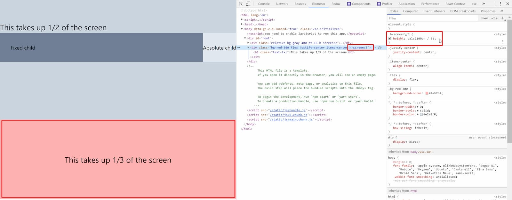

Let's extend Tailwind CSS's height (`h-`) utility for `50vh`, `33.33333vh`, `25vh`, and `20vh`.

## Prerequisite

You have to know what Tailwind CSS is and how to set it up yourself.

## Problem

Tailwind CSS ("tailwind" hereafter) has a utility class, [h-screen](https://tailwindcss.com/docs/height/#screen-height) to turn an element to take up `100vh` vertical space.

But there is no granular classes for granular heights such as 50vh, 25vh, etc.  
_And the [Tailwind decided not to add such utilities](https://github.com/tailwindcss/tailwindcss/issues/191)._

The only way to do is to add a custom configuration.

## Updating Tailwind Configuration

You can extend the `h-` utility by updating your `tailwind.config.js` file.  
The important part is to wrap your new utility with [`extend`](https://tailwindcss.com/docs/theme/#extending-the-default-theme).

```javascript
module.exports = {
  theme: {
    // 👇 this makes Tailwind merge the configuration w/o overriding it.
    extend: {
      height: theme => ({
        "screen/2": "50vh",
        "screen/3": "calc(100vh / 3)",
        "screen/4": "calc(100vh / 4)",
        "screen/5": "calc(100vh / 5)",
      }),
    },
  },
  variants: { display: ["responsive", "hover", "focus"] },
  plugins: [],
}
```

You can specify the height like `50vh` (refer to `screen/2`) or calculate with `calc` (for `screen/2~5`).



## Source Code

https://github.com/dance2die/blog.extending-tailwind-css-screen-height-utility
